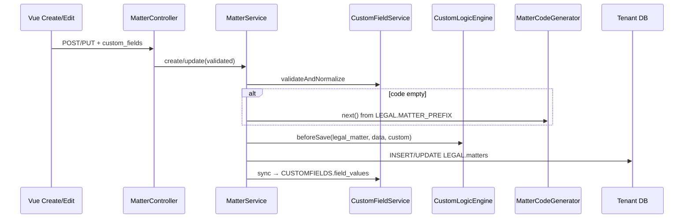

# Architecture

Per-tenant differences **without** `if ($tenantId === '001')`.

Same PHP/Vue code path. Firm A vs B differ because **tenant DB data** (consts + field defs) differs.

```text
Ladder (prefer lower first):
  1. Consts          → SYSCONFIG.config_consts
  2. Serials         → SYSCONFIG.config_snums
  3. Custom fields   → CUSTOMFIELDS.*
  4. Custom logic    → services reading consts + field values
  5. Plan / modules  → central tenants.plan
  6. Vertical module → app/Modules/Legal …
```

> **Scope note:** the worked example below (`LEGAL.matters` / `MATTER_PREFIX` / `PrefixedMatterCodeGenerator`) is
> the currently-shipped slice of `LEGAL_SPECS.md` §3B (Matters) — real, routed, tested code
> (`app/Modules/Legal/Controllers/MatterController.php`, `tests/Feature/LegalMatterCrudTest.php`) — used here
> purely to demonstrate the ladder mechanism end-to-end. `LEGAL_SPECS.md` specs a much larger notary/PPAT
> deed-management model (`LEGAL.deeds`, `protocol_entries`, deed numbering via a protocol-book row-lock) that
> builds out around this same table per the spec's own build order (§5); `LEGAL.deeds` has shipped its first slice
> too (§3C, draft/ready_for_signing/signed/archived lifecycle) but protocol numbering isn't wired yet. Treat this
> page's ladder mechanics (consts → serials → custom fields → custom logic) as canonical, and its
> `matters`-specific table/column names as this module's real (if partial) shape.

---

## 1. DB

### 1.1 Tenant DB layout

Mode B: one PostgreSQL database per tenant. No `tenant_id` on app tables.

```text
tenant_001 / tenant_002
├── SYSCONFIG.          # menus, groups, rights, consts
├── INVENTORY.
├── LEGAL.              # core entity columns only
├── CUSTOMFIELDS.       # EAV — tenant-specific attrs
└── …
```

Central DB (`nusaevo`): `tenants`, `tenant_user_lookups`, `tenants.plan` only.

### 1.2 `CUSTOMFIELDS` schema

Migration: `database/migrations/tenant/2026_07_17_150001_create_custom_fields_tables.php`

```text
CUSTOMFIELDS.field_defs      # what fields exist for an entity
CUSTOMFIELDS.field_values    # values per entity row
```

**field_defs**

| Column | Type | Notes |
|--------|------|--------|
| `id` | bigint PK | |
| `uuid` | uuid unique | external-facing |
| `entity_type` | string | e.g. `legal_matter` |
| `code` | string | stable key (`court_register`) |
| `label` | string | UI label |
| `field_type` | string | `text` \| `number` \| `date` \| `select` |
| `options` | json nullable | select: `[{label, value}]` |
| `is_required` | bool | validated on save |
| `seq` | int | form order |
| `status` | string | `active` / inactive |
| unique | | `(entity_type, code)` |

**field_values**

| Column | Type | Notes |
|--------|------|--------|
| `id` | bigint PK | |
| `field_def_id` | bigint | app-enforced link to def |
| `entity_type` | string | same as def |
| `entity_id` | bigint | owner row PK |
| `value` | text nullable | all types stored as text; cast in service |
| unique | | `(field_def_id, entity_type, entity_id)` |

ponytail: single `value` column. Ceiling: typed columns / JSONB if reporting needs heavy filters.

### 1.3 Related core tables (not EAV)

| Schema.table | Role |
|--------------|------|
| `LEGAL.matters` | Fixed domain columns (`code`, `title`, `matter_type`, `partner_id`, `assigned_to`, `status`, `opened_at`, `target_close_at`, `converted_from_lead_id`, `notes`, `uuid`) |
| `LEGAL.deeds` | Fixed domain columns (`matter_id`, `deed_type_id`, `category`, `deed_number`, `status`, `signing_date`, `minuta_reference`, `summary`, `amends_deed_id`, `uuid`) |
| `SYSCONFIG.config_consts` | Runtime knobs (`LEGAL.MATTER_PREFIX`, `LEGAL.URGENT_SETS_PENDING`) |
| `SYSCONFIG.config_snums` | Document serial counters (netapp1 `config_snums`) — e.g. `LEGAL_MATTER_LASTID` |

Do **not** add tenant-specific nullable columns to `LEGAL.matters`/`LEGAL.deeds`. Put them in `CUSTOMFIELDS`.

### 1.4 Demo seed data

`TenantFlavorSeeder` (after SysConfig):

| | Firm A (`001`) | Firm B (`002`) |
|--|----------------|----------------|
| field_defs | `court_register`*, `hearing_date`, `priority`* | `lease_object`*, `monthly_rent`, `priority` |
| `LEGAL.MATTER_PREFIX` | `A` | `B` |
| `LEGAL.URGENT_SETS_PENDING` | `1` | `0` |

\* required.

---

## 2. Code

### 2.1 Module map

```text
app/Modules/CustomFields/          # Core
├── Models/
│   ├── FieldDef.php               # CUSTOMFIELDS.field_defs
│   └── FieldValue.php             # CUSTOMFIELDS.field_values
└── Services/
    ├── CustomFieldService.php     # defs, validate, sync, formPayload
    └── CustomLogicEngine.php      # beforeSave hooks from consts + values

app/Modules/Legal/                 # Vertical (consumer)
├── Contracts/MatterCodeGenerator.php
├── Services/
│   ├── MatterService.php          # orchestrates CF + logic + persist
│   ├── PrefixedMatterCodeGenerator.php
│   └── DeedService.php            # §3C lifecycle (draft→ready_for_signing→signed→archived)
├── Controllers/MatterController.php, DeedController.php
└── Requests/Store|UpdateMatterRequest.php, Store|UpdateDeedRequest.php

app/Providers/AppServiceProvider.php
  → bind MatterCodeGenerator → PrefixedMatterCodeGenerator

resources/js/
├── Components/forms/CustomFieldInputs.vue
└── Pages/Legal/Matters/{Create,Edit}.vue, Legal/Deeds/{Create,Edit}.vue
```

### 2.2 Boundaries

| Layer | Owns | Must not |
|-------|------|----------|
| CustomFields (Core) | EAV + generic logic engine | Import Legal models |
| Legal (Vertical) | Domain service, matter codes, routes | Put EAV tables under `LEGAL` |
| SYSCONFIG | Consts / menus / rights | Hard-code Firm A/B |

### 2.3 Wire pattern (any entity)

```text
Controller
  → formPayload(entity_type, id?)
Service create/update
  → validateAndNormalize(custom_fields)
  → (optional) MatterCodeGenerator / domain helpers
  → CustomLogicEngine::beforeSave
  → persist core row
  → sync(entity_type, id, values)
Service delete
  → deleteFor → delete core row
```

### 2.4 Save sequence (Legal)



### 2.5 Tests

`tests/Feature/CustomFieldsLegalMatterTest.php`

- Urgent + const on → status `on_hold`, auto prefix, values stored
- Required custom field missing → session validation error

`tests/Feature/LegalDeedCrudTest.php`

- Signing without a signing date is rejected
- A signed deed is immutable at the service layer (`DeedService::update` throws)

---

## 3. Custom

Two kinds of “custom” — both config/data driven, never `tenant_id` branches.

### 3.1 Custom fields (data shape)

Extra attributes per entity, defined per tenant in `field_defs`, stored in `field_values`.

- UI: `CustomFieldInputs` on Legal create/edit
- Validation: required / type / select options in `CustomFieldService`
- Admin CRUD for defs: **not yet** (seed / SQL)

Add to another entity:

1. Seed defs with new `entity_type` (e.g. `inventory_item`)
2. Wire that module’s Service like Legal
3. Reuse `CustomFieldInputs.vue`

### 3.2 Custom logic (behavior)

#### A. Strategy / contract + serial counter

```php
// AppServiceProvider
$this->app->bind(MatterCodeGenerator::class, PrefixedMatterCodeGenerator::class);
```

`PrefixedMatterCodeGenerator::next()` reads `LEGAL.MATTER_PREFIX` and allocates via `ConfigSnumService::next('LEGAL_MATTER_LASTID')` (atomic `lockForUpdate`, wrap at `wrap_high`).

Blank code on create → auto `{PREFIX}-{NNN}`. Firm A/B differ by seeded const + snum `last_cnt`.

Admin UI: System → Serials (`/config/serials`).

#### B. Engine hooks

`CustomLogicEngine::beforeSave($entityType, $data, $customValues)` mutates core payload.

Current Legal rule:

```text
LEGAL.URGENT_SETS_PENDING enabled
AND custom field priority = urgent
AND status = open
→ set status = on_hold
```

| Const | Firm A | Firm B | Effect |
|-------|--------|--------|--------|
| `URGENT_SETS_PENDING` | on | off | Same code; A forces on_hold, B keeps open |

ponytail: flat ifs in engine. Ceiling: pluggable Rule classes when rules multiply.

### 3.3 Constants that drive custom logic

| const_group | group_code | Meaning |
|-------------|------------|---------|
| `LEGAL` | `MATTER_PREFIX` | Auto matter code prefix |
| `LEGAL` | `URGENT_SETS_PENDING` | `num1>0` → urgent forces on_hold |

UI: System → Constants (`/config/consts`).

### 3.4 Do / Don’t

| Do | Don’t |
|----|-------|
| Put tenant-specific attrs in `CUSTOMFIELDS` | Add nullable columns to `LEGAL.matters` for one firm |
| Drive behavior from consts + field values | `if (tenant_id === '001')` |
| Keep CustomFields Core | Leak Legal model into CustomFieldService |
| Prefer consts before engine rules | New microservice for simple toggles |

---

## Related

- Agent guidance: [CLAUDE.md](CLAUDE.md)
- Design system: [resources/DESIGN.md](resources/DESIGN.md)
- Plan gates: `config/tenant_modules.php`, `TenantFeatureService`
