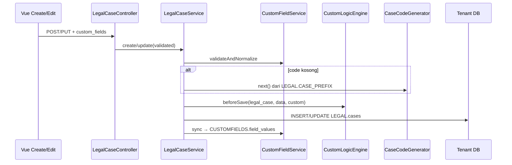

# Architecture

Perbedaan per-tenant **tanpa** `if ($tenantId === '001')`.

Jalur kode PHP/Vue yang sama. Firma A vs B berbeda karena **data DB tenant** (consts + definisi field) berbeda.

```text
Tangga (utamakan yang lebih rendah dahulu):
  1. Consts          → SYSCONFIG.config_consts
  2. Custom fields   → CUSTOMFIELDS.*
  3. Custom logic    → service yang membaca consts + nilai field
  4. Plan / modul    → tenants.plan pusat
  5. Modul vertikal  → app/Modules/Legal …
```

---

## 1. DB

### 1.1 Layout DB Tenant

Mode B: satu database PostgreSQL per tenant. Tidak ada `tenant_id` di tabel aplikasi.

```text
tenant_001 / tenant_002
├── SYSCONFIG.          # menu, group, rights, consts
├── INVENTORY.
├── LEGAL.              # hanya kolom entitas inti
├── CUSTOMFIELDS.       # EAV — atribut khusus tenant
└── …
```

DB Pusat (`nusaevo`): hanya `tenants`, `tenant_user_lookups`, `tenants.plan`.

### 1.2 Schema `CUSTOMFIELDS`

Migration: `database/migrations/tenant/2026_07_17_150001_create_custom_fields_tables.php`

```text
CUSTOMFIELDS.field_defs      # field apa saja yang ada untuk sebuah entitas
CUSTOMFIELDS.field_values    # nilai per baris entitas
```

**field_defs**

| Kolom | Tipe | Catatan |
|--------|------|--------|
| `id` | bigint PK | |
| `uuid` | uuid unik | menghadap eksternal |
| `entity_type` | string | misalnya `legal_case` |
| `code` | string | kunci stabil (`court_register`) |
| `label` | string | label UI |
| `field_type` | string | `text` \| `number` \| `date` \| `select` |
| `options` | json nullable | select: `[{label, value}]` |
| `is_required` | bool | divalidasi saat disimpan |
| `seq` | int | urutan form |
| `status` | string | `active` / tidak aktif |
| unique | | `(entity_type, code)` |

**field_values**

| Kolom | Tipe | Catatan |
|--------|------|--------|
| `id` | bigint PK | |
| `field_def_id` | bigint | tautan ke def yang ditegakkan oleh aplikasi |
| `entity_type` | string | sama dengan def |
| `entity_id` | bigint | PK baris pemilik |
| `value` | text nullable | semua tipe disimpan sebagai teks; di-cast di service |
| unique | | `(field_def_id, entity_type, entity_id)` |

ponytail (sederhana dulu): hanya satu kolom `value`. Ceiling (batas atas jika dibutuhkan): kolom bertipe / JSONB jika reporting butuh filter berat.

### 1.3 Tabel Inti Terkait (bukan EAV)

| Schema.tabel | Peran |
|--------------|------|
| `LEGAL.cases` | Kolom domain tetap (`code`, `title`, `status`, `notes`, `uuid`) |
| `SYSCONFIG.config_consts` | Pengaturan runtime (`LEGAL.CASE_PREFIX`, `LEGAL.URGENT_SETS_PENDING`) |
| `SYSCONFIG.config_snums` | Penomor seri dokumen (netapp1 `config_snums`) — misalnya `LEGAL_CASE_LASTID` |

**Jangan** menambahkan kolom nullable khusus tenant ke `LEGAL.cases`. Taruh di `CUSTOMFIELDS`.

### 1.4 Data Seed Demo

`TenantFlavorSeeder` (setelah SysConfig):

| | Firma A (`001`) | Firma B (`002`) |
|--|----------------|----------------|
| field_defs | `court_register`*, `hearing_date`, `priority`* | `lease_object`*, `monthly_rent`, `priority` |
| `LEGAL.CASE_PREFIX` | `A` | `B` |
| `LEGAL.URGENT_SETS_PENDING` | `1` | `0` |

\* wajib diisi (required).

---

## 2. Kode

### 2.1 Peta Modul

```text
app/Modules/CustomFields/          # Core
├── Models/
│   ├── FieldDef.php               # CUSTOMFIELDS.field_defs
│   └── FieldValue.php             # CUSTOMFIELDS.field_values
└── Services/
    ├── CustomFieldService.php     # def, validasi, sync, formPayload
    └── CustomLogicEngine.php      # hook beforeSave dari consts + nilai

app/Modules/Legal/                 # Vertikal (konsumen)
├── Contracts/CaseCodeGenerator.php
├── Services/
│   ├── LegalCaseService.php       # mengorkestrasi CF + logic + persist
│   └── PrefixedCaseCodeGenerator.php
├── Controllers/LegalCaseController.php
└── Requests/Store|UpdateLegalCaseRequest.php

app/Providers/AppServiceProvider.php
  → bind CaseCodeGenerator → PrefixedCaseCodeGenerator

resources/js/
├── Components/forms/CustomFieldInputs.vue
└── Pages/Legal/Cases/{Create,Edit}.vue
```

### 2.2 Batasan (Boundaries)

| Layer | Memiliki | Tidak boleh |
|-------|------|----------|
| CustomFields (Core) | EAV + generic logic engine | Mengimpor model Legal |
| Legal (Vertikal) | Service domain, kode case, route | Menaruh tabel EAV di bawah `LEGAL` |
| SYSCONFIG | Consts / menu / rights | Hardcode Firma A/B |

### 2.3 Pola Penyambungan (Wire Pattern) (entitas apa pun)

```text
Controller
  → formPayload(entity_type, id?)
Service create/update
  → validateAndNormalize(custom_fields)
  → (opsional) CaseCodeGenerator / helper domain lain
  → CustomLogicEngine::beforeSave
  → persist baris inti (core row)
  → sync(entity_type, id, values)
Service delete
  → deleteFor → hapus baris inti
```

### 2.4 Urutan Penyimpanan (Legal)



### 2.5 Test

`tests/Feature/CustomFieldsLegalCaseTest.php`

- Urgent + const aktif → status `pending`, prefix otomatis, nilai tersimpan
- Custom field wajib yang hilang → error validasi session

---

## 3. Custom

Dua jenis "custom" — keduanya berbasis config/data, tidak pernah cabang `tenant_id`.

### 3.1 Custom fields (bentuk data)

Atribut tambahan per entitas, didefinisikan per tenant di `field_defs`, disimpan di `field_values`.

- UI: `CustomFieldInputs` pada create/edit Legal
- Validasi: required / tipe / opsi select di `CustomFieldService`
- CRUD admin untuk def: **belum ada** (seed / SQL)

Menambahkan ke entitas lain:

1. Seed def dengan `entity_type` baru (misalnya `inventory_item`)
2. Sambungkan Service modul tersebut seperti Legal
3. Gunakan ulang `CustomFieldInputs.vue`

### 3.2 Custom logic (perilaku)

#### A. Strategy / contract + serial counter

```php
// AppServiceProvider
$this->app->bind(CaseCodeGenerator::class, PrefixedCaseCodeGenerator::class);
```

`PrefixedCaseCodeGenerator::next()` membaca `LEGAL.CASE_PREFIX` dan mengalokasikan via `ConfigSnumService::next('LEGAL_CASE_LASTID')` (atomik `lockForUpdate`, wrap pada `wrap_high`).

Kode kosong saat create → otomatis `{PREFIX}-{NNN}`. Firma A/B berbeda melalui const yang di-seed + `last_cnt` snum.

UI admin: System → Serials (`/config/serials`).

#### B. Hook Engine

`CustomLogicEngine::beforeSave($entityType, $data, $customValues)` memodifikasi payload inti.

Aturan Legal saat ini:

```text
LEGAL.URGENT_SETS_PENDING aktif
DAN custom field priority = urgent
DAN status = open
→ set status = pending
```

| Const | Firma A | Firma B | Efek |
|-------|--------|--------|------|
| `URGENT_SETS_PENDING` | aktif | nonaktif | Kode sama; A memaksa pending, B tetap open |

ponytail: flat if di engine. Ceiling: kelas Rule yang bisa dipasang (pluggable) saat aturan bertambah banyak.

### 3.3 Konstanta yang menggerakkan custom logic

| const_group | group_code | Makna |
|-------------|------------|---------|
| `LEGAL` | `CASE_PREFIX` | Prefix kode case otomatis |
| `LEGAL` | `URGENT_SETS_PENDING` | `num1>0` → urgent memaksa pending |

UI: System → Constants (`/config/consts`).

### 3.4 Do / Don't (Lakukan / Jangan)

| Lakukan | Jangan |
|----|-------|
| Taruh atribut khusus tenant di `CUSTOMFIELDS` | Menambahkan kolom nullable ke `LEGAL.cases` untuk satu firma |
| Gerakkan perilaku dari consts + nilai field | `if (tenant_id === '001')` |
| Jaga CustomFields tetap Core | Membocorkan model Legal ke dalam CustomFieldService |
| Utamakan consts sebelum aturan engine | Microservice baru untuk toggle sederhana |

---

## Terkait

- Panduan agen: [CLAUDE.md](CLAUDE.md)
- Sistem desain: [resources/DESIGN.md](resources/DESIGN.md)
- Gerbang plan: `config/tenant_modules.php`, `TenantFeatureService`
