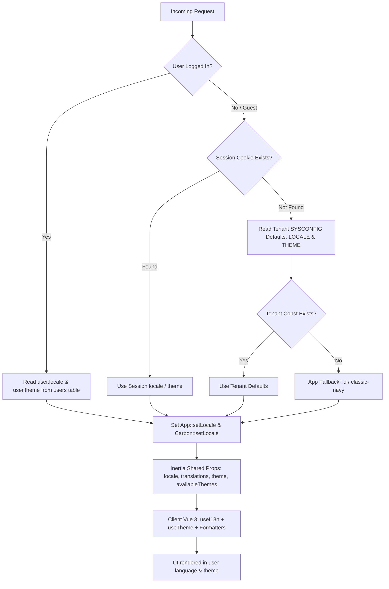

# Spesifikasi Fitur Preferensi Pengguna: Multi-Bahasa (i18n) & Tema Visual (Theme) Per-User
## Dukungan Dwibahasa (ID/EN) & Personalisasi Tema Tampilan Tanpa Batasan Hak Akses pada Nusaevo ERP

---

# 1. Latar Belakang

> Titik masalah, urgensi operasional, dan nilai bisnis.

Nusaevo ERP merupakan platform SaaS ERP multi-tenant dengan fokus vertikal (Legal, Distribusi, Manufaktur, Jasa Keuangan, dll.). Untuk menghadirkan pengalaman pengguna (*user experience*) yang optimal dan personal bagi setiap individu dalam organisasi tenant:
1. **Preferensi Bahasa (Language / Locale)**: Pengguna memiliki latar belakang berbeda — staf operasional lokal Indonesia, manajemen eksekutif, konsultan internasional, hingga partner asing — membutuhkan antarmuka dwibahasa (**Bahasa Indonesia `id`** dan **English `en`**) yang fleksibel.
2. **Preferensi Tema Tampilan (Theme & Dark/Light Mode)**: Sebelumnya, penggantian tema dibatasi hanya untuk administrator yang memiliki izin `CONFIG_THEME` dan berefek ke seluruh tenant (*tenant-wide*). Hal ini membatasi kenyamanan individu (misalnya user yang bekerja malam hari membutuhkan *dark mode*, sedangkan user lain lebih nyaman dengan *light mode* atau aksen warna tertentu).

### Kebutuhan Klien:
- **Tersimpan Per Pengguna (*Per-User Persistence*)**: Pilihan bahasa (`locale`) dan tema (`theme`) disimpan secara mandiri pada profil akun masing-masing pengguna di database tenant.
- **Bebas Akses untuk Semua Pengguna (*No Permission Barrier*)**: Setiap pengguna yang login (tanpa memandang role/jabatan dan tanpa perlu hak akses `CONFIG_THEME`) dapat langsung mengganti tema visual dan bahasa melalui header maupun menu profil.
- **Hierarki Resolusi Cerdas (*Resolution Fallback*)**:
  - *User Preference* > *Tenant Default Const* (`SYSCONFIG`) > *Session/Cookie* > *App Default*.
- **Reaktivitas Instan**: Perubahan bahasa dan tema langsung diterapkan ke DOM dan seluruh komponen UI Vue 3 tanpa merusak state aplikasi.

---

# 2. Tujuan (Goals)

### MVP (Fase 1 — Fondasi & UI Core)
- **Skema Database Pengguna**: Penambahan kolom `locale` (`VARCHAR(10) DEFAULT 'id'`) dan `theme` (`VARCHAR(50) DEFAULT 'classic-navy'`) pada tabel `users` di database tenant.
- **Penghapusan Pembatasan Izin Tema**:
  - Menghapus pembatasan `menu.perm:CONFIG_THEME` pada switcher tema di header (`ThemeSwitcher.vue`).
  - Endpoint update preferensi tema (`POST /user/theme` atau `config/theme`) terbuka untuk semua pengguna terotentikasi (`auth`, `verified`).
- **Hierarki Resolusi 4-Tier**:
  1. *User Authenticated Preference* (`users.locale`, `users.theme`)
  2. *Tenant Default Const* (`SYSCONFIG.config_consts` → `LOCALE.default_language`, `THEME.active_theme`)
  3. *Guest / Session Cookie* (`session('locale')`, `session('theme')`)
  4. *Application Fallback* (`locale='id'`, `theme='classic-navy'`)
- **Backend Middleware & Shared Props**:
  - Middleware `SetUserLocale` untuk mengeksekusi `App::setLocale($locale)` dan `Carbon::setLocale($locale)`.
  - Shared props di `HandleInertiaRequests`: `locale`, `availableLocales`, `translations`, `theme` (resolusi per user), dan `availableThemes`.
- **Frontend Composable & Helper**:
  - Composable `useI18n` untuk fungsi translasi `t(key, replacements)`.
  - Composable `useTheme` untuk aktivasi tema per-user secara instan.
  - Formatters adaptif di `resources/js/Utils/formatters.ts` (`formatDate`, `formatCurrency`, `formatNumber`, `formatTerbilang`).
- **Komponen UI**:
  - `LanguageSwitcher.vue` dan `ThemeSwitcher.vue` aktif di `AppHeader.vue` untuk **semua user**.
  - Dropdown pilihan Bahasa dan Tema di `Profile/Edit.vue` (`UpdateProfileInformationForm.vue`).
- **Kamus Translasi**:
  - `lang/id.json` & `lang/en.json` untuk string antarmuka umum.
  - `lang/id/validation.php`, `lang/en/validation.php`, `lang/id/auth.php`, `lang/en/auth.php`.

### Future Version (Fase 2 — Fitur Lanjutan)
- **Terjemahan Dinamis Menu**: Translasi otomatis judul menu `SYSCONFIG.config_menus`.
- **Notifikasi WNE Dwibahasa**: Pengiriman email/SMS otomatis dalam bahasa penerima (`recipient.locale`).
- **Pencetakan Dokumen Bilingual**: Pilihan cetak PDF Invoice, Bukti Kas, Surat Kuasa dalam bahasa ID, EN, atau format dwibahasa berdampingan.

---

# 3. Form / Engine & Arsitektur Teknis



## 3A. Hierarki Resolusi Preferensi

| Prioritas | Bahasa (`locale`) | Tema (`theme`) |
| :--- | :--- | :--- |
| **1 (User Auth)** | `users.locale` (`'id'`, `'en'`) | `users.theme` (`'classic-navy'`, `'midnight-dark'`, dll.) |
| **2 (Session/Guest)** | `session('locale')` | `session('theme')` |
| **3 (Tenant Default)** | `SYSCONFIG`: `LOCALE.default_language` | `SYSCONFIG`: `THEME.active_theme` |
| **4 (System Fallback)**| `config('app.fallback_locale')` (`'id'`) | `ThemeService::DEFAULT_THEME` (`'classic-navy'`) |

## 3B. Skema Database & Migrasi Tenant

### Migrasi Tabel `users` (Database Tenant)
File: `database/migrations/tenant/2026_09_06_000001_add_locale_and_theme_to_users_table.php`

```php
use Illuminate\Database\Migrations\Migration;
use Illuminate\Database\Schema\Blueprint;
use Illuminate\Support\Facades\Schema;

return new class extends Migration
{
    public function up(): void
    {
        Schema::table('users', function (Blueprint $table) {
            $table->string('locale', 10)->default('id')->after('email');
            $table->string('theme', 50)->default('classic-navy')->after('locale');
        });
    }

    public function down(): void
    {
        Schema::table('users', function (Blueprint $table) {
            $table->dropColumn(['locale', 'theme']);
        });
    }
};
```

## 3C. Arsitektur Isolasi Bahasa Per Modul (*Modular Language Isolation*) & Pesan Error JSON

Sesuai prinsip arsitektur Modular Monolith Nusaevo ERP, berkas translasi diisolasi per domain modul dengan hierarki sebagai berikut:

```
├── lang/
│   ├── id.json                     # Shared Core: common.*, nav.*, profile.*, header.*, status.*, error.*, messages.*, validation.*
│   └── en.json                     # Shared Core (English)
└── app/Modules/
    ├── Legal/Lang/
    │   ├── id.json                 # Domain Legal: menu.LEGAL_*, legal.*, legal.msg.*, legal.err.*
    │   └── en.json
    ├── Accounting/Lang/
    │   ├── id.json                 # Domain Accounting: menu.ACCOUNTING_*, accounting.*, accounting.msg.*, accounting.err.*
    │   └── en.json
    ├── CRM/Lang/
    │   ├── id.json                 # Domain CRM: menu.CRM_*, crm.*, crm.msg.*, crm.err.*
    │   └── en.json
    ├── Inventory/Lang/
    │   ├── id.json                 # Domain Inventory: menu.INVENTORY_*, inventory.*, inventory.msg.*, inventory.err.*
    │   └── en.json
    ├── Sales/Lang/, Purchase/Lang/, HCM/Lang/, Payroll/Lang/, Performance/Lang/, MES/Lang/, PP/Lang/, POS/Lang/, DMS/Lang/, WNE/Lang/, SysConfig/Lang/, dll.
```

### Mekanisme Penggabungan Otomatis (*Auto-Discovery & Runtime Parity*):
1. **Backend Integration**: `AppServiceProvider::boot()` mendaftarkan direktori `app/Modules/*/Lang` ke Laravel Translator via `Translator::addJsonPath()`. Dengan ini, pemanggilan backend `__('legal.matter')` atau `__('error.unauthorized')` bekerja secara instan pada Controller, Service, dan JSON API responses.
2. **Frontend Inertia Props**: `LocaleService::getTranslations($locale)` secara cerdas memuat `lang/{$locale}.json` utama lalu menggabungkan (*merge*) seluruh kamus `app/Modules/*/Lang/{$locale}.json` dengan runtime in-memory caching.
3. **Pesan Kesalahan (Error JSON) & Flash Messages**:
   - `error.unauthorized`, `error.forbidden`, `error.not_found`, `error.validation_failed`, `error.csrf_token_expired`, `error.record_locked`, `error.invalid_credentials`, dll.
   - `messages.saved_success`, `messages.deleted_success`, `messages.created_success`, `messages.posted_success`, `messages.approved_success`, dll.
   - `<module>.msg.*` & `<module>.err.*` untuk pesan spesifik transaksi bisnis modul.

---

# 4. Backend Engine & Routing

### 1. `LocaleService.php` & `ThemeService.php`
- `ThemeService::getCurrentTheme(?int $userId = null)`:
  1. Jika `$userId` ada, baca `User::find($userId)->theme`.
  2. Jika null, baca `ConfigService::get('THEME', 'active_theme')`.
  3. Fallback: `classic-navy`.
- `ThemeService::setUserTheme(User $user, string $themeKey)`:
  - Validasi key tema.
  - Update `user.theme`.
  - Simpan ke session (`session(['theme' => $themeKey])`).

### 2. Controller & Routing
- Endpoint `POST /user/preferences` (atau `POST /user/locale` & `POST /user/theme`):
  - Terbuka untuk semua user yang login (`middleware(['auth', 'verified'])`).
  - **TIDAK memerlukan `menu.perm:CONFIG_THEME`**.
  - Menyimpan preferensi secara atomik dan mengembalikan respon `back()`.

### 3. Middleware `HandleInertiaRequests.php`
```php
'locale' => fn () => ($user && tenancy()->initialized)
    ? app(LocaleService::class)->resolveLocale($request)
    : session('locale', config('app.fallback_locale', 'id')),
'availableLocales' => fn () => app(LocaleService::class)->getAvailableLocales(),
'translations' => fn () => app(LocaleService::class)->getTranslations(
    app(LocaleService::class)->resolveLocale($request)
),
'theme' => fn () => ($user && tenancy()->initialized)
    ? ($user->theme ?? app(ThemeService::class)->getCurrentTheme((int) $user->id))
    : session('theme', ThemeService::DEFAULT_THEME),
'availableThemes' => fn () => app(ThemeService::class)->getAvailableThemes(),
```

---

# 5. Frontend UI & Komponen

### 1. `ThemeSwitcher.vue` di `AppHeader.vue`
- **Hapus pengecekan `v-if="canManageTheme"`**: Tombol palet tema tampil untuk semua user.
- Mengganti tema langsung mengeksekusi `setTheme(themeId, true)` yang memanggil endpoint user preference.

### 2. `LanguageSwitcher.vue` di `AppHeader.vue`
- Menampilkan bendera 🇮🇩 / 🇬🇧 dan nama bahasa aktif.
- Memungkinkan penggantian bahasa dalam 1 klik.

### 3. Formulir Pengaturan Profil (`Profile/Partials/UpdateProfileInformationForm.vue`)
- Menambahkan pilihan:
  - **Bahasa Antarmuka (`locale`)**: Bahasa Indonesia / English.
  - **Tema Tampilan (`theme`)**: Dropdown/Grid palet tema yang tersedia.

---

# 6. Catatan Teknis & Kepatuhan AGENTS.md

1. **Prinsip Bebas Akses**:
   - Preferensi antarmuka personal (bahasa & tema) adalah hak dasar setiap pengguna (*user-level experience*), bukan hak administratif modul.
   - Halaman `/config/theme` di SysConfig tetap dapat digunakan oleh Admin untuk menentukan *Tenant Default Theme*, namun tidak lagi mengunci switcher pengguna di header.
2. **Kepatuhan Desain Sistem**:
   - Menggunakan `FormSelect.vue`, `PrimaryButton.vue`, `Panel.vue`, dan token warna tema dinamis (`bg-surface-0`, `border-border`, `text-ink-900`).
3. **Pengujian (TDD)**:
   - Tes penggantian bahasa per-user.
   - Tes penggantian tema per-user oleh non-admin tanpa permission `CONFIG_THEME`.
   - Tes fallback tenant-wide dan app default.
